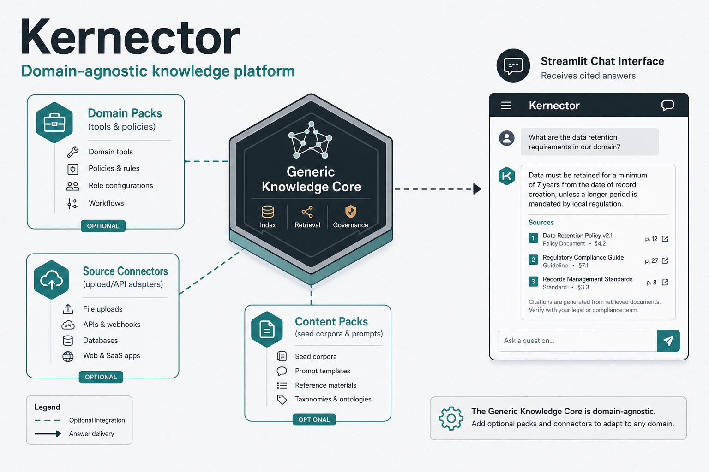
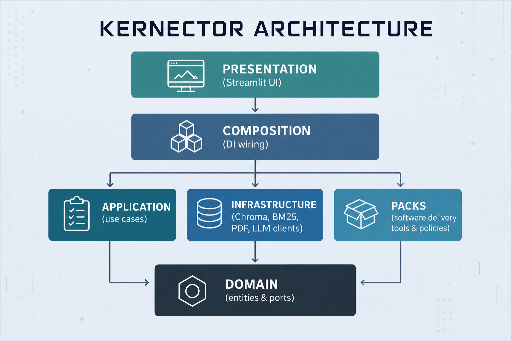
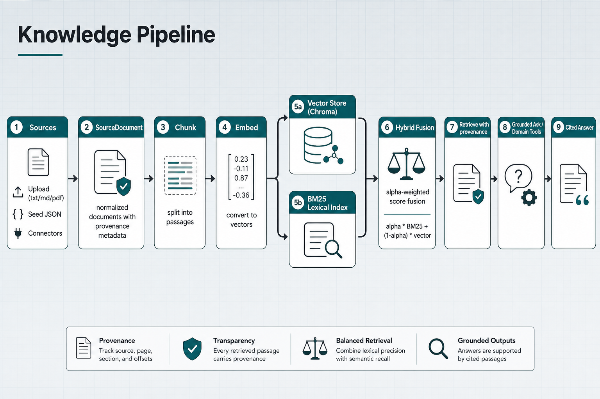

# Kernector



Kernector is a domain-agnostic knowledge platform built around a shared ingest and retrieval pipeline. Uploaded TXT, Markdown, and PDF files, plus seed JSON corpora, normalize into `SourceDocument`; the core then chunks, embeds, stores, and retrieves with provenance so answers can cite what they used. Domain vocabulary stays out of the reusable core. Optional packs supply business meaning; the current ingest adapters are file upload and the on-disk seed JSON loader. External provider connectors (for example Jira or Confluence) are planned, not shipped. The default seed corpus at `data/knowledge/documents.json` is neutral. Story Intelligence samples under `data/knowledge/packs/story-intelligence/` demonstrate a content pack without defining platform requirements.

Architecture and layering live in [ARCHITECTURE.md](ARCHITECTURE.md). The domain-agnostic direction is recorded in [ADR 0001](docs/adr/0001-domain-agnostic-knowledge-foundation.md). The Next.js / HTTP presentation migration is recorded in [ADR 0002](docs/adr/0002-nextjs-presentation-migration.md). Seed format details are in [data/knowledge/README.md](data/knowledge/README.md).

## How the platform is structured

Dependency arrows point inward toward `domain`. Presentation never owns business logic; infrastructure never imports application use cases; packs never reach into composition or Streamlit.



`domain/` holds entities, validation, and port protocols and imports only the standard library. `application/` implements use cases such as ingest, rewrite-and-retrieve, grounded ask, and tool invocation, speaking to the outside world only through those ports. `infrastructure/` supplies concrete adapters — Chroma vector storage, in-memory BM25, PDF/text loaders, catalog JSON, and LLM provider clients. `packs/` are optional executable modules. Today `packs/software_delivery/` registers `software_delivery.risk_score`, `software_delivery.generate_test_cases`, `software_delivery.export_test_cases_markdown`, and a deterministic chat-intent policy, without importing application or presentation code. `composition/` is the sole wiring root: it loads settings, constructs adapters, activates enabled packs through an explicit allowlist, and hands typed services to the UI. `presentation/` hosts the Streamlit app and CLI entrypoints; it calls through composition and must not construct infrastructure or import packs directly.

This split keeps the UI replaceable and prevents ticket- or SDLC-shaped types from re-entering the shared contracts. New product behavior arrives as a pack, not as a fork of the core pipeline. New source kinds would arrive as additional adapters that emit `SourceDocument`; only upload and seed JSON are implemented today.

## Knowledge path from source to cited answer

Normalized documents follow one pipeline whether they arrived as an upload or a seed JSON row. Additional connector payloads are planned behind the same `SourceDocument` boundary.



After chunking and embedding, passages land in Chroma with metadata that preserves source identity. When hybrid search is enabled, the same corpus also feeds a BM25 lexical index; retrieval fuses the two channels with a configurable alpha weight (`alpha * BM25 + (1 - alpha) * vector`), then keeps provenance on each hit. Grounded ask attaches retrieved chunks as context. Streamlit renders citations from `Citation` as source ID, source type, optional chunk index, and quote — not page or section links (see `_render_citations` in `presentation/streamlit/app.py`).

When `DOMAIN_TOOL_PACKS` includes `software-delivery` and a General-mode query explicitly requests risk scoring or test-case generation, composition routes through evidence-bundle orchestration instead of free-form generation, still citing the underlying hits. Unmatched queries stay on the ordinary RAG path — intent matching is a deterministic pack policy, not a speculative classifier.

## Dual-stack local workflow

Streamlit and Next.js are peer presentation clients. Streamlit talks to
composition directly; Next.js talks HTTP to FastAPI. Copy [`.env.example`](.env.example)
to `.env` for Python/HTTP flags (no secrets committed). Next public vars:
[`web/.env.example`](web/.env.example) → `web/.env.local`.

| Process | Default URL | Command |
| --- | --- | --- |
| FastAPI | `http://127.0.0.1:8000` | `HTTP_DEV_CORS=true uv run uvicorn presentation.http.app:app --reload` |
| Next.js | `http://localhost:3000` | `cd web && npm ci && npm run dev` |
| Streamlit | `http://localhost:8501` | `uv run streamlit run main.py` |

**Startup order for Next:** start FastAPI first (health chip needs `/health` +
CORS), then Next. Streamlit does not require FastAPI.

### Run the Streamlit app

```bash
uv run streamlit run main.py
```

### Run the HTTP API

FastAPI adapter under `presentation/http/` (peer to Streamlit). Development CORS
for the Next.js origin is enabled only when `HTTP_DEV_CORS` is truthy
(`1` / `true` / `yes` / `on`). Optional `HTTP_CORS_ORIGINS` (default
`http://localhost:3000`; `*` is rejected). Both flags load through Settings /
`.env` like other config.

```bash
HTTP_DEV_CORS=true uv run uvicorn presentation.http.app:app --reload
```

Or set the same keys in `.env`, then:

```bash
uv run uvicorn presentation.http.app:app --reload
```

- Unversioned ops: `GET /health`
- Versioned prove-out: `GET /api/v1/capabilities`
- Settings catalog: `GET /api/v1/settings`
- Grounded chat: `POST /api/v1/chat/ask`
- OpenAPI: `GET /openapi.json` (also `/docs`)

**Dev vs production CORS:** leave `HTTP_DEV_CORS` unset/false in production
unless you intentionally set an explicit `HTTP_CORS_ORIGINS` allowlist. Never
use `*`. `NEXT_PUBLIC_*` values are baked into the Next.js build — set
`NEXT_PUBLIC_API_BASE_URL` in the build environment before `npm run build`.

### Run the Next.js web shell

The App Router foundation lives in [`web/`](web/) (Node 22+, npm). See
[`web/README.md`](web/README.md) for full details.

```bash
# API with CORS for the Next.js origin (required for the header health chip)
HTTP_DEV_CORS=true uv run uvicorn presentation.http.app:app --reload

# separate terminal
cd web
npm ci
npm run dev   # http://localhost:3000
```

Public env (optional overrides in `web/.env.local`): `NEXT_PUBLIC_APP_NAME`,
`NEXT_PUBLIC_API_BASE_URL` (defaults to `http://127.0.0.1:8000`).

With both processes up, open `/settings` for provider/model controls and `/chat`
for grounded ask (history, citations, tools-used, projected tool results). Chat
reads runtime selections from `localStorage` (`kernector:runtime-settings:v1`)
and persists the transcript under `kernector:chat-messages:v1`. Streamlit chat
remains available until retirement (#228).

OpenAPI → TypeScript: from `web/`, `npm run api:generate`. Drift check:
`npm run api:check` (also run on PRs to `main`).

Other commands: `npm run build`, `npm run lint`, `npm run typecheck`, `npm test`.

### CI (pull requests to `main`)

Workflow: [`.github/workflows/ci.yml`](.github/workflows/ci.yml). Reproduce
locally (no provider API keys required):

```bash
uv sync --frozen && uv run pytest

cd web
npm ci
npm run lint && npm run typecheck && npm test && npm run build
npm run api:check   # needs uv at repo root
```

### Feature-migration readiness

Before migrating a Streamlit feature to Next.js, use
[docs/migration-readiness.md](docs/migration-readiness.md).

### Troubleshooting

- **Next health chip Unavailable / CORS errors** — Ensure FastAPI is up,
  `HTTP_DEV_CORS` is truthy, and the browser origin matches `HTTP_CORS_ORIGINS`
  (default `http://localhost:3000`).
- **OpenAPI contract drift** — `cd web && npm run api:generate`, then commit
  updated `openapi/openapi.json` and `lib/api/generated/schema.d.ts`.
- **Port already in use** — Stop the other process on 8000 / 3000 / 8501, or
  pass an alternate port to uvicorn / `next dev` / Streamlit.
- **Embedding size / Chroma mismatch** — remove the local store and retry:
  `rm -rf data/chroma`.

## Hybrid search (optional)

Retrieval defaults to vector-only (Chroma cosine). To combine BM25 with vector
scores on the product retrieve path:

```bash
export HYBRID_SEARCH_ENABLED=true
export HYBRID_ALPHA=0.5   # BM25 weight; 1=BM25 only, 0=vector only
```

When hybrid is on, `RELEVANCE_THRESHOLD` remains a **raw cosine** eligibility
floor for the vector channel (applied before normalization/fusion). Hybrid hit
scores returned to ask/tool paths are fused ranking scores in `[0, 1]`, not
absolute relevance probabilities — do not retune the threshold against those
fused values. Lexical eligibility is token-overlap BM25. Metadata filters still
apply to both sides.

Streamlit caches one vector store (`st.cache_resource`) and injects it into chat
retrieval and document create/replace/delete so the in-memory BM25 index stays
current without re-hydrating from Chroma on every rerun.

## Upload and manage documents

1. Start the app with the command above.
2. Under **Upload new document**, choose one supported file: `.txt`, `.md`, `.markdown`, or `.pdf`.
3. Submit **Upload new**. The app assigns a system-managed UUID source ID (never derived from the file name). Matching filenames create separate documents.
4. Under **Uploaded documents**, select a row to inspect status, chunk count, and the diagnostic source ID.
5. To overwrite content for a selected document, choose a replacement file and submit **Replace** (same source ID; old chunks are replaced). Filenames never trigger replacement by themselves.
6. To remove a document, confirm and click **Delete** (vector chunks first, then the catalog row).

Upload catalog metadata is stored at `data/catalog/uploads.json` by default (`DOCUMENT_CATALOG_PATH`). Seed-corpus documents remain separate and do not appear in this list.

Create, replace, and delete run to completion before the page refreshes, and the outcome appears above the document list on the refreshed page. A failure that left chunks or a catalog row behind says so and names the action to retry; one that changed nothing says only what went wrong.

If ingest fails because the store expects a different embedding size, remove the local Chroma directory and try again:

```bash
rm -rf data/chroma
```

## Logging and monitoring

Kernector emits structured stdlib logging for ask, rewrite/retrieve, ingest, and
tool invocation. Set the process log level with `LOG_LEVEL` (default `INFO`):

```bash
LOG_LEVEL=DEBUG uv run streamlit run main.py
```

`load_runtime_settings()` applies this at composition bootstrap.

### Correlation lifecycle

Every chat path from `build_tool_augmented_ask` is wrapped in `CorrelatedAsk`,
including when no Software Delivery pack is enabled. On each
`GroundedAsk.execute` turn:

1. Bind a `request_id` (UUID hex) via a `ContextVar`, or **reuse** an id already
   bound by an outer caller.
2. Nested ask / rewrite-retrieve / invoke-tool logs read that same id.
3. Restore the previous ContextVar binding with `reset(token)` in a `finally`
   block — never force-clear a caller’s outer context.

### Log format

Each operation emits **one single-line JSON object** (sorted keys), for example:

```json
{"hit_count":1,"latency_ms":12,"model":"test-model","operation":"ask","outcome":"success","request_id":"…","source_type":"knowledge_document","total_tokens":99}
```

Typical fields when available:

- `operation` / `outcome` (`ask`, `rewrite_retrieve`, `invoke_tool`, `ingest`, `ask_turn`)
- `outcome` values: `success`, `insufficient`, `error`, or `delegated` (router
  handed off to grounded ask; the nested `ask` event is terminal)
- `request_id`, `path` (`rag` | `tools` | `task_prompt`)
- `pack` (`software-delivery` on tool routes)
- `tool`, `prompt_key`, `source_type`
- `hit_count` / `chunk_count` / `source_count`
- `latency_ms`, `model`, token usage ints from `RunMeta`

String field values are normalized (control characters / newlines replaced) so
one call cannot forge additional log lines or alternate `operation` events.

**Do not expect logs to contain:** document or chunk text, prompts, secrets or
API keys, raw provider bodies, tool arguments/results, or exception *messages*
(only exception type names such as `"error_type":"ProviderError"`).

Workspace/tenant correlation is deferred until an authorized identity exists;
storage details such as the Chroma collection name are not logged as a
workspace id.

### Run details in Streamlit

Each completed Ask turn (success, insufficient evidence, or operational failure)
can show a collapsed **Run details** expander. Metadata reaches the UI only
through typed `RunMeta` on `AskResponse.run` / `AskTurnResult.run` — never by
parsing log files.

When present, the expander may show:

- request ID
- outcome (`success` / `insufficient` / `error`)
- latency
- model
- token usage
- pack
- query rewritten (`yes` / `no`) — flag only, never the query text
- retrieval hit count
- citation count (one entry per citation attached to the response; same as hit count today because citations are built 1:1 from hits without deduplication)
- invoked tool **names**

Unset optional fields are omitted. The UI does **not** display prompts, queries,
retrieved chunks, document content, tool arguments/results, secrets, raw
provider responses, generation settings blobs, or exception text (including
`error_type`).

The diagrams document implemented layering and the current ingest path. Extending
Kernector means enabling packs behind composition’s allowlist, or adding adapters
that emit `SourceDocument`, without widening the shared domain with
product-specific entities.
