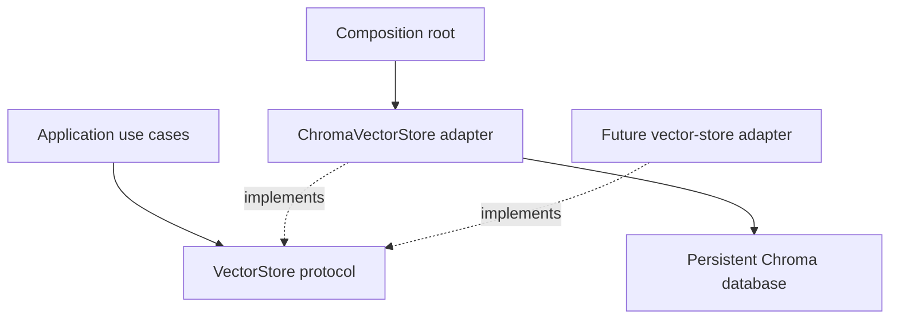

# Implement #84: Chroma Adapter Behind the `VectorStore` Port

Track: [#84](https://github.com/mahmoudazaid/Kernector/issues/84)  
Epic: [#68](https://github.com/mahmoudazaid/Kernector/issues/68)  
Depends on: [#77](https://github.com/mahmoudazaid/Kernector/issues/77)  
Related chunking: [#83](https://github.com/mahmoudazaid/Kernector/issues/83)  
Next ingestion use case: [#85](https://github.com/mahmoudazaid/Kernector/issues/85)

## Goal

Add a persistent Chroma implementation of the existing `VectorStore` protocol without exposing Chroma to the domain or application layers.

`ChromaVectorStore` is one infrastructure adapter behind the provider-independent contract in `domain/ports.py`. Replacing Chroma later must require only a new adapter and a composition-root wiring change—not changes to chunking, ingestion, domain entities, or application use cases.

## Architecture



| Layer                                  | Responsibility                                              |
| -------------------------------------- | ----------------------------------------------------------- |
| `domain/ports.py`                      | Keep the provider-independent `VectorStore` protocol        |
| `domain/knowledge.py`                  | Reuse `EmbeddedChunk`, `ScoredChunk`, and metadata entities |
| `infrastructure/vectorstore/chroma.py` | Implement the Chroma-specific adapter                       |
| `infrastructure/config.py`             | Load Chroma configuration                                   |
| `composition/container.py`             | Select and construct the concrete adapter                   |
| `application/`                         | Depend only on `VectorStore`; never import Chroma           |

Do not move `VectorStore` merely for this ticket. A later refactor may move it to `domain/ports/vector_store.py` if `domain/ports.py` becomes difficult to maintain.

## In scope

- Add and lock the `chromadb` dependency, and record the resolved version
- Persistent local Chroma storage
- Configurable persistence path and collection name
- Precomputed-vector insertion and querying
- Cosine-distance configuration
- Deterministic, collision-safe record IDs
- Idempotent upserts
- Reversible metadata serialization
- Complete domain-object reconstruction
- Top-k search returning `ScoredChunk`
- Composition-root construction
- Documentation-only additions to the `VectorStore` protocol (see §0)
- Unit, integration, architecture, and restart tests

## Out of scope

- Changing `VectorStore` parameters or types (docstrings excepted—see §0)

**Accepted deviation:** `VectorStore.add` was renamed to `VectorStore.upsert`. The
name `add` described insert-only semantics while the contract is an upsert, and the
rename was free: `VectorStore` had no callers, no adapter, and no tests at the time.
Parameters, annotations, and return types are unchanged. A `delete` operation was
considered and rejected — see §5.1; it belongs to #85.
- Widening `SourceMetadata.extra` beyond `Mapping[str, str]` (see §6.1)
- Adding a linter, formatter, or type checker to the project (see §14.1)
- File upload or extraction
- Document chunking
- Embedding generation
- Ingestion orchestration ([#85](https://github.com/mahmoudazaid/Kernector/issues/85))
- Metadata-filtered retrieval ([#86](https://github.com/mahmoudazaid/Kernector/issues/86))
- Deleting or reconciling stale chunks (see §5.1)
- Query rewriting or hybrid search
- Multi-tenancy or remote Chroma
- Typed application-wide errors ([#98](https://github.com/mahmoudazaid/Kernector/issues/98))
- Anything from [#113](https://github.com/mahmoudazaid/Kernector/issues/113)
- LangChain vector-store wrappers
- UI changes

## 0. Write the port contract down

`VectorStore.upsert` and `VectorStore.search` in `domain/ports.py` currently carry no docstrings, so the behavior a second adapter must reproduce exists only in this plan. That makes the replaceability claim in **Goal** untrue in practice.

Add docstrings to the two existing methods. Do not change their parameters or annotations. Document:

- `upsert` is idempotent for a given derived identity; re-adding replaces content, vector, and metadata
- `upsert` returns without effect for empty input
- `search` returns nearest-first
- `search` returns an empty sequence when `limit <= 0` or the store is empty
- `search` rejects a `limit` that is not an `int`, and rejects `bool` specifically rather than letting `False` fall through to the `limit <= 0` rule
- `search` scores are cosine similarity in `[-1.0, 1.0]`, higher is nearer, never clamped
- Both raise a `RuntimeError` subclass on adapter-level failure

This is the only permitted change to `domain/ports.py` in #84. The domain layer stays stdlib-only, so `test/domain/test_domain_boundaries.py` is unaffected.

## 1. Dependency

Run `uv add chromadb`. Then, before writing any adapter code:

1. Record the resolved version in this plan and in the PR description. §4 and §9 depend on it.
2. Diff `uv.lock` and confirm the resolution did not downgrade or re-pin `numpy` (project requires `>=2.5.1`) or `langchain-core`. chromadb constrains `numpy` and pulls a large transitive tree (grpc, opentelemetry, tokenizers, and others).
3. Confirm every new package resolves a wheel for Python 3.13; the project sets `requires-python = ">=3.13"`.
4. Identify where the locked version caches default-embedding-function model files, and which environment variable redirects that location. Record both here—§11's embedding-function test depends on them. If no redirect exists, record that too; the test then falls back to asserting the default cache directory is unchanged.
5. Identify the mechanism the locked version uses to open a collection with *no* embedding function, and whether reopening an existing collection re-initializes one. Record it here; §4 step 7 and §11 both depend on it.

Commit `pyproject.toml` and `uv.lock` only after those five checks pass. Do not add LangChain.

### Recorded results — chromadb **1.5.9**

1. **Resolved version: `chromadb==1.5.9`.**
2. **No collateral changes.** The `uv.lock` diff contains zero removed `name`/`version`
   lines — pure additions. `numpy` stays `2.5.1`, `langchain-core` `1.5.4`,
   `langchain-openai` `1.5.0`.
3. **Every package resolved a Python 3.13 wheel.** Only `kernector` itself lacks one,
   as expected for the local project.
4. **Model cache: no environment variable exists.** The path is the class attribute
   `ONNXMiniLM_L6_V2.DOWNLOAD_PATH`, evaluated at import time as
   `Path.home() / ".cache" / "chroma" / "onnx_models" / "all-MiniLM-L6-v2"`. It is a
   real class attribute, so §11 redirects it with
   `monkeypatch.setattr(ONNXMiniLM_L6_V2, "DOWNLOAD_PATH", tmp_path / "model-cache")`
   rather than falling back to snapshotting the default directory.
   Note also that `DefaultEmbeddingFunction.__init__` is a no-op in 1.5.9 — the ONNX
   model is imported and instantiated only inside `__call__`.
5. **No embedding function:** pass `embedding_function=None` explicitly to
   `get_or_create_collection`. The parameter's default is a live
   `DefaultEmbeddingFunction()` instance, not a sentinel, so omitting it installs one.
   Reopening with `None` does not re-initialize one; `configuration_json` then reports
   `"embedding_function": {"type": "legacy"}`, which is a persisted marker, not a live
   function.

`onnxruntime 1.29.0` is a hard dependency of chromadb 1.5.9, so "absent from
`sys.modules`" was never available as evidence for §11 — consistent with the warning
already in that section.

`chromadb` is already listed in `IO_PACKAGES` in `test/architecture/test_layer_boundaries.py`, so application and presentation are already forbidden from importing it. No architecture-test change is required for this—only confirmation that the existing suite still passes.

## 2. Persisted data

Add `data/chroma/` to `.gitignore`. `data/knowledge/` is committed and must stay committed.

Every test must write only under `tmp_path` and must never touch the repository default store. See §3.1 for why setting `CHROMA_PERSIST_PATH` alone is not sufficient to guarantee this.

## 3. Configuration

Extend `infrastructure/config.py`:

```python
@dataclass(frozen=True, slots=True)
class ChromaSettings:
    persist_path: Path
    collection: str
```

Add `chroma: ChromaSettings` to the root `Settings` object.

| Variable              | Default               |
| --------------------- | --------------------- |
| `CHROMA_PERSIST_PATH` | `data/chroma`         |
| `CHROMA_COLLECTION`   | `kernector_knowledge` |

Rules:

- Reject a blank or whitespace-only collection name with `ValueError`, matching the existing `_load_chunking_settings` style
- Do not validate the collection name against Chroma's own naming rules here; that is vendor-specific and belongs in the adapter (§4.1)
- Expand `~`
- Resolve relative paths against `Path(__file__).resolve().parents[1]`, not the CWD. This matches the precedent in `infrastructure/prompts/markdown_repository.py`, which uses `parents[2]` from one directory deeper
- Preserve absolute paths
- Do not create directories while merely loading settings
- Create the directory only when constructing the adapter

Test defaults, path resolution, blank and whitespace collection rejection, and absence of configuration-time filesystem writes. For the last one, assert the resolved `persist_path` does not exist after `load_settings()` when pointed at a fresh `tmp_path` subdirectory; do not patch `Path.mkdir`.

### 3.1 Environment isolation in tests

`load_settings()` calls `load_dotenv(override=True)`, so values in `.env` beat `os.environ`. A test that sets `CHROMA_PERSIST_PATH` with `monkeypatch.setenv` will be silently overridden the moment anyone adds that key to their local `.env`—and the test will still pass while writing to the developer's real store.

Therefore:

- Adapter tests (§11) construct `ChromaSettings(persist_path=tmp_path / "chroma", collection=...)` directly. They must not call `load_settings()`.
- The container test (§13) that must exercise the env path monkeypatches `infrastructure.config.load_dotenv` to a no-op, then asserts the built store's resolved path is under `tmp_path` before doing anything else.

## 4. Adapter location and construction

Create:

```
infrastructure/vectorstore/__init__.py
infrastructure/vectorstore/chroma.py
```

Implement `ChromaVectorStore(config: ChromaSettings)`. Structural typing is sufficient; it need not explicitly inherit from the Protocol.

The constructor must:

1. Validate the collection name against Chroma's rules (§4.1)
2. Create the persistence directory
3. Construct `chromadb.PersistentClient` from client settings built deterministically—identical values on every construction for a given `ChromaSettings` (§4.4)
4. Disable anonymized telemetry
5. Open or create the configured collection
6. Ensure the collection uses cosine distance
7. Use no default embedding function, because callers always supply embeddings

`chromadb.config.Settings` collides by name with `infrastructure.config.Settings`. Alias it on import, for example `from chromadb.config import Settings as ChromaClientSettings`.

### 4.1 Collection-name validation

Chroma enforces its own naming rules (length bounds, permitted characters, must start and end alphanumeric, not an IP address). `infrastructure/config.py` rejects only blank names, so `CHROMA_COLLECTION="my collection"` would otherwise surface as a raw vendor exception at construction time. Validate in the adapter and raise `ChromaStoreError` (§4.3) with the offending value. Confirm the exact rules against the locked version rather than transcribing them from memory.

**Verified against 1.5.9.** It raises `chromadb.errors.InvalidArgumentError` for names
under 3 characters, names containing spaces or non-ASCII, names not starting and
ending alphanumeric, names containing `..`, and IPv4-shaped names.

**It does not enforce the 63-character ceiling** that `check_index_name` in
`chromadb/api/segment.py` documents — 64 and 128 characters were both accepted. The
adapter enforces `3 <= len(name) <= 63` itself for that reason.

Note that `InvalidArgumentError` derives from `ChromaError` → `Exception`, **not**
`ValueError`, while the client-settings collision in §4.4 raises a plain `ValueError`.
Adapter code must catch both to satisfy §4.3.

### 4.2 Cosine configuration and verification

The API for requesting cosine distance and for reading it back differs across Chroma versions—older releases use `metadata={"hnsw:space": "cosine"}` and expose it on `collection.metadata`; newer ones use a `configuration=` argument and expose `collection.configuration_json`. Do not write these calls before §1 has locked a version.

Once locked, record the exact call in this plan. If `get_or_create_collection` opens an existing collection, verify its stored distance configuration is cosine and raise `ChromaStoreError` on mismatch rather than silently reusing an incompatible index. If the locked version does not expose the stored space readably, say so here and drop the verification requirement from the Definition of Done rather than leaving an unimplementable bullet.

**Recorded for 1.5.9.** Request cosine with the `configuration=` argument, and read the
stored space back from `configuration_json`:

```python
collection = client.get_or_create_collection(
    name=name,
    configuration={"hnsw": {"space": "cosine"}},
    embedding_function=None,
)
space = (collection.configuration_json or {}).get("hnsw", {}).get("space")
```

`collection.metadata` is `None` in 1.5.9 — the older `metadata={"hnsw:space": ...}`
approach does not work and cannot be read back.

**Verification is mandatory, not optional.** `get_or_create_collection` *silently
ignores* `configuration` when the collection already exists: requesting cosine against
a stored `l2` collection returns the l2 collection with no error, and every score
would be wrong with nothing to indicate it. An l2 collection does read back as `"l2"`,
so the mismatch is detectable and the Definition of Done keeps this bullet.

### 4.3 Error type

Define one module-level exception in `infrastructure/vectorstore/chroma.py`:

```python
class ChromaStoreError(RuntimeError):
    """Raised when the Chroma adapter cannot honor the VectorStore contract."""
```

Every adapter-level failure in §4 through §9 raises this, not a bare `RuntimeError`. Tests assert on `ChromaStoreError`. Callers catching `RuntimeError` still work, and [#98](https://github.com/mahmoudazaid/Kernector/issues/98) can re-parent one class instead of rewriting every `pytest.raises`.

### 4.4 Lifecycle and concurrency model

The supported MVP model is one writer at a time. Concurrent writes from multiple
processes are out of scope.

Sequential Streamlit reruns in the same process must remain supported. Constructing
`ChromaVectorStore` twice on the same path in one process must therefore reopen the
same collection successfully. A clear failure is not an acceptable outcome, because
#85 will require a usable store across application reruns.

Instance caching is not the answer here. §10 keeps `build_vector_store` a pure
factory, and the layer that actually needs to hold one instance across reruns is
presentation (`st.cache_resource`), which is out of scope for #84. Caching is #85's
decision; #84's job is to make repeated construction work.

The likely mechanism is that Chroma caches its client system keyed by the client
settings, so repeated construction succeeds only when those settings are identical
each time and fails when they differ. Confirm this against the locked version. If it
holds, "build client settings deterministically" is a hard constructor requirement
(§4, step 3), not an implementation detail. Spike this before writing the adapter:
§11 has exactly one test for it and no fallback branch.

**Confirmed for 1.5.9.** Two `PersistentClient`s on one path with identical settings
both open, and the second sees records written through the first. With *differing*
settings the second raises:

```
ValueError: An instance of Chroma already exists for <path> with different settings
```

So deterministic client settings are a hard requirement. The adapter builds them in
`_client_settings()`, which returns `ChromaClientSettings(anonymized_telemetry=False)`
and nothing derived from mutable state — note that `chromadb.config.Settings` reads
`CHROMA_*` environment variables, so anything env-derived could drift mid-process.

Readers may reopen the persisted path in later processes, as verified by the
restart test in §12.

## 5. Collision-safe deterministic IDs

Do not concatenate raw fields with a delimiter. Build a canonical payload containing `source_type`, `source_id`, and `chunk_index`, serialize it using deterministic JSON (`sort_keys=True`, `ensure_ascii=False`, fixed separators), and use its SHA-256 digest as the record ID. Include a scheme-version key in the payload so a future change to the derivation is detectable rather than silently colliding with existing records.

Store the original identity fields in metadata; decoding must never depend on reversing the hash.

Tests must cover determinism, different indexes/types, Unicode and delimiter-containing IDs, idempotent re-addition, and duplicate derived IDs inside one batch. Reject duplicate batch IDs with `ChromaStoreError` rather than silently choosing a winner.

### 5.1 Stale chunks are not handled

Because the ID derives from `(source_type, source_id, chunk_index)`, re-ingesting a document after `CHUNK_SIZE` increases will upsert the lower indexes and leave every higher-index chunk from the previous run orphaned in the collection forever. The `VectorStore` port has no delete operation, so #84 cannot fix this.

Bumping the ID scheme version (§5) is the same failure at larger scale: every ID re-derives, orphaning the entire existing collection at once. Treat a scheme bump as requiring a full rebuild of the store, and say so next to wherever the version constant is defined.

Idempotent upsert is not the same as correct re-ingestion. Record this limitation in the adapter docstring and carry it into [#85](https://github.com/mahmoudazaid/Kernector/issues/85), which owns re-ingestion.

## 6. Metadata encoding

Use reserved scalar keys for:

- `source_id`
- `source_type`
- `chunk_index`
- `title` when not `None`
- `provider` when not `None`
- `content_format` when not `None`

Serialize the complete `SourceMetadata.extra` mapping as canonical JSON under `extra_json`; do not flatten arbitrary keys in #84.

The reason is round-trip fidelity, not type preservation: a single JSON envelope round-trips keys containing delimiters, reserved names, Unicode, and empty strings without escaping rules, and it keeps arbitrary caller keys out of Chroma's scalar metadata namespace where [#86](https://github.com/mahmoudazaid/Kernector/issues/86) will want to add filterable fields.

Before writing, reject values that are not JSON-serializable with a contextual `ChromaStoreError`; never silently call `str()`. During decoding, missing `extra_json` means an empty mapping, while malformed JSON or a decoded non-mapping is treated as corrupt persisted data.

Metadata filtering remains #86. That ticket may promote explicitly selected filterable fields to scalar Chroma metadata.

### 6.1 `extra` values are strings

`SourceMetadata.extra` is declared `Mapping[str, str]` in `domain/knowledge.py`, and the established convention is that callers pre-serialize nested data themselves—see `test/application/test_chunking.py`, which uses `extra={"provider_field": "whatever", "tags_json": '["a"]'}`.

#84 does not widen that type. Concretely:

- Encode assumes string values and round-trips them exactly, including a value that is itself a JSON document, byte-for-byte
- The non-JSON-serializable rejection branch (§6) is defensive only. `SourceMetadata.__post_init__` validates only `reference`, so `extra` is unenforced at runtime and a caller can violate the annotation. Keep the guard; test it by constructing a mapping that violates the annotation deliberately, with a comment saying so
- Do not write tests that place lists, booleans, numbers, or `null` in `extra`. Those contradict the declared type

**Follow-up required before #85.** The seeded corpus in `data/knowledge/documents.json` has non-string values (`tags` is a list, `severity` is `null`). Mapping that corpus into `SourceMetadata.extra` will need either caller-side serialization into `*_json` string keys or a domain change widening `extra` to `Mapping[str, object]` with matching `__post_init__` validation. Open that as its own ticket; do not fold it into #84.

## 7. Symmetric encoding and decoding

Implement private encode/decode helpers. Decode in this order:

```
SourceReference → SourceMetadata → DocumentChunk → ScoredChunk
```

Reconstruct every domain type so its validation runs. Note that this is a weaker guard than it looks: `SourceReference`, `DocumentChunk`, and `ScoredChunk` validate their fields, but `SourceMetadata.__post_init__` checks only `reference`—it does not validate `title`, `provider`, `content_format`, or `extra`. The adapter must therefore validate those itself rather than relying on the domain to catch corrupt persisted values.

At the infrastructure boundary, convert corrupt-record validation failures into `ChromaStoreError` with the offending record ID, instead of exposing raw `KeyError`, `TypeError`, `JSONDecodeError`, `DomainValidationError`, or vendor exceptions.

Persistence guarantees metadata value equality, not Python object identity.

## 8. `upsert`

Implement the existing method:

```python
def upsert(self, embedded: Sequence[EmbeddedChunk]) -> None:
    ...
```

Required behavior:

- Return immediately for empty input
- Validate the complete batch before writing
- Reject items that are not `EmbeddedChunk`
- Require every vector to be non-empty, numeric, finite, and free of booleans. `EmbeddedChunk` validates non-empty and numeric but not finite, so the finite check is the adapter's responsibility
- Require one consistent vector dimension per batch
- Detect duplicate derived IDs
- Build parallel IDs, embeddings, documents, and metadata lists, where the document is `chunk.content`
- Call `collection.upsert(...)`
- Always supply embeddings; never ask Chroma to generate them
- Convert collection dimension mismatches and any other vendor exception into `ChromaStoreError`

Do not claim atomic writes unless guaranteed by the locked Chroma version.

## 9. `search`

Implement:

```python
def search(self, vector: Vector, limit: int) -> Sequence[ScoredChunk]:
    ...
```

Behavior:

- Reject boolean or non-integer limits with `ChromaStoreError`
- Return `()` when `limit <= 0`, matching the contract documented in §0
- Validate the query vector as non-empty, numeric, finite, and without booleans
- Query using `query_embeddings=[list(vector)]`
- Request documents, metadata, and distances
- Handle an empty collection as `()`
- Defensively validate the nested result structure and equal result lengths
- Reject missing or `None` documents, metadata, or distances
- Decode every result into a `DocumentChunk`
- Convert cosine distance using `score = 1.0 - distance`
- Return a tuple of `ScoredChunk` values in nearest-first order
- Wrap every vendor exception—including a query/collection dimension mismatch—in `ChromaStoreError`

Chroma cosine distance lies in `[0.0, 2.0]`, so `score` lies in `[-1.0, 1.0]` and may legitimately be negative. `ScoredChunk` accepts any finite float. Document the range on the adapter and at the port (§0); do not clamp. Use approximate assertions for floating-point tests, and avoid zero vectors in cosine tests.

Requesting more results than the collection holds emits a Chroma warning rather than an error. That is acceptable today; note that enabling `-W error` in pytest configuration later would turn it into a failure.

**Not reproduced on 1.5.9.** `n_results=50` against a 3-record collection returned 3
with no error *and no warning*, so the `-W error` caveat does not apply to the locked
version. Also verified numerically: distance `0.0` → score `1.0`, distance `2.0` →
score `-1.0`, and a query dimension mismatch raises
`InvalidArgumentError: Collection expecting embedding with dimension of 3, got 2`.

## 10. Composition-root wiring

Update `composition/container.py`:

```python
def build_vector_store(settings: Settings) -> VectorStore:
    return ChromaVectorStore(settings.chroma)
```

The return annotation must be `VectorStore`, not `ChromaVectorStore`. Re-export the builder through `composition/__init__.py`, preserving its alphabetical `__all__` convention—`build_vector_store` sorts after `build_prompt_repository`.

Keep this a pure factory: a fresh adapter per call, no memoization. A settings-keyed cache here would retain an open SQLite handle to a `tmp_path` directory pytest has already deleted, and would need an explicit `cache_clear()` fixture in §13. Holding one instance across Streamlit reruns is presentation's concern and #85's decision (§4.4).

Only composition selects Chroma; application modules must not instantiate or import it.

## 11. Tests

Create `test/infrastructure/vectorstore/test_chroma.py`, mirroring the module path the way `test/application/test_chunking.py` mirrors `application/chunking.py`. Add no `__init__.py`, matching `test/application/` and `test/composition/`.

Use `tmp_path`, handwritten vectors, and no network or embedding service. Build `ChromaSettings` directly per §3.1.

Consider one shared populated store for the read-only search cases; each test that builds its own pays HNSW index construction. Such a fixture must be `module`- or `session`-scoped and must therefore use `tmp_path_factory`—`tmp_path` is function-scoped and cannot be requested from a broader scope. The reopen, embedding-function, and corrupt-record cases need fresh state and must keep building their own stores.

For the corrupt-record cases, use the adapter's own `_collection` attribute from the test rather than opening a second client on the same path, and note in a comment that the test deliberately reaches past the public surface.

### Metadata

- Complete optional-field round trip
- `None` optional fields
- Empty `extra`
- A string value that is itself a JSON document, round-tripped byte-for-byte
- Unicode keys and values, keys containing delimiters, and empty-string values
- Keys that collide with reserved scalar names
- Non-JSON-serializable value rejection, via a deliberate annotation violation (§6.1)
- Metadata value equality after persistence

### Writes

- Empty input no-op
- Single and batch writes
- Idempotent re-addition
- Re-addition updates content, vector, and metadata
- Different identities remain separate
- Duplicate batch IDs rejected
- Mixed dimensions rejected before reaching Chroma
- `NaN` and infinity rejected
- Non-`EmbeddedChunk` items rejected

### Search

- Empty collection and non-positive limit return `()`
- Top-k count and ordering
- Identical non-zero vector scores approximately `1.0`
- Three distinct vectors produce expected ordering
- An opposing vector yields a negative score, unclamped
- Query dimension mismatch raises `ChromaStoreError`
- Empty, boolean, and non-finite vector values rejected
- `limit` greater than the collection size returns everything, without error

### Collection configuration

- Existing cosine collection opens
- Existing non-cosine collection is rejected
- Reopening does not recreate the collection
- Invalid collection names are rejected by the adapter (§4.1)
- Two adapters constructed sequentially on the same path in one process both open
  successfully, and the second reads the record written through the first (§4.4).
  There is no fallback branch: if this cannot be made to pass, revise the adapter
  constructor, not the test

### No default embedding function

Prove that construction, add, reopen, and search do not download or initialize
Chroma's default embedding model.

The test must:

- Redirect the model cache to an empty `tmp_path` using the environment variable recorded in §1, step 4. If the locked version exposes no redirect, snapshot the default cache directory's contents first and assert they are unchanged afterward
- Block network access for the duration of the tested operations by monkeypatching `socket.socket` to raise. Apply it *after* `chromadb` is imported, so import-time setup is not what fails
- Construct the store with the no-embedding-function mechanism recorded in §1, step 5
- Add a record using an explicitly supplied vector
- Reopen the same collection
- Search using an explicitly supplied query vector
- Assert the redirected cache directory is still empty

Do not use the absence of `onnxruntime` from `sys.modules` as proof; module-import
state does not prove that no download or model initialization occurred.

If the locked Chroma version cannot reopen the collection without initializing a
default embedding function, stop and revise the adapter construction before implementation.

### Corrupt records

Insert malformed records through the private collection handle and confirm `ChromaStoreError` for missing reserved fields, invalid `SourceType`, invalid chunk index, malformed `extra_json`, and non-mapping `extra_json`.

## 12. Process-restart proof

Use two independent subprocesses:

1. A writer opens a `tmp_path` store, writes one record, and exits
2. A reader opens the same path, performs no write, searches, and verifies content and metadata

A same-process second client is insufficient. Reuse the existing pattern from `test_composition_root_boots_without_presentation` in `test/composition/test_container.py`: `sys.executable`, `cwd=REPO_ROOT`, `capture_output=True`, and assert on `result.stderr`. `cwd=REPO_ROOT` is load-bearing—`pythonpath = ["."]` in `pyproject.toml` applies to pytest only, not to a bare subprocess.

Each subprocess pays a full Chroma import. Two of them is acceptable; do not grow this into a per-case pattern.

## 13. Composition and architecture tests

Extend the container tests to build the store with `load_dotenv` patched out per §3.1, point `CHROMA_PERSIST_PATH` at `tmp_path`, assert the resolved path is under `tmp_path`, confirm the built object is `ChromaVectorStore`, and verify its methods satisfy the port. Concrete-type assertions belong only in composition tests.

Add `build_vector_store` to `test_composition_root_boots_without_presentation`'s smoke script only if it does not slow the subprocess materially.

**Architecture tests need no changes.** These four properties are already enforced by `test/architecture/test_layer_boundaries.py` and `test/domain/test_domain_boundaries.py`, and `find_forbidden_imports` matches top-level package roots, so `from infrastructure.vectorstore.chroma import ChromaVectorStore` in application already trips on `infrastructure`:

- Application does not import `chromadb` or reach `ChromaVectorStore` — already covered; `chromadb` is in `IO_PACKAGES` and `infrastructure` is forbidden to `application`
- Domain does not import Chroma or infrastructure — already covered by the domain allowlist
- Infrastructure may depend on domain contracts and Chroma — already permitted
- Composition may depend on both the port and adapter — already permitted

Run them and confirm they pass. Do not add an architecture-test exception for application code.

The one property no existing rule expresses is that composition is the *sole* importer of the adapter. Adding it means new logic in `test/architecture/import_scan.py`. Treat as optional for #84; note it if skipped.

**Skipped in #84.** No rule catches a module outside composition importing
`ChromaVectorStore` *by name*. The gap is narrow, because `application` and
`presentation` are already forbidden from importing `infrastructure` at all and
`chromadb` is already in `IO_PACKAGES`; what remains unguarded is another
*infrastructure* module reaching for the adapter directly. Worth its own ticket
alongside the tooling one from §14.1.

## 14. Verification

```
uv sync
uv run pytest test/infrastructure/vectorstore/test_chroma.py -v
uv run pytest test/composition/test_container.py -v
uv run pytest test/architecture test/domain -v
uv run pytest -q
```

For manual persistence verification, use one command that only writes, then a separate fresh process that only reads and asserts the stored result. Do not run an upsert in the reader.

Finally:

```
ls data/chroma
git status --porcelain
```

`data/chroma/` must remain ignored. Existing unrelated working-tree changes do not need to disappear.

### 14.1 There is no lint or type-check step

The project has no linter, formatter, or type checker: `pyproject.toml` declares none, there is no `[tool.ruff]` section, there is no CI workflow, and `ruff` is not installed. A `uv run ruff check .` step would fail, and "run the repository's configured formatter and type checker" refers to nothing that exists.

#84 does not add them. Do not let the absence of a type checker excuse loose annotations—the `extra` typing issue in §6.1 is exactly the class of problem a type checker would have surfaced. Open tooling as its own ticket.

## Definition of Done

- `chromadb` is locked at **1.5.9**, its resolved version recorded (§1), and `uv.lock` verified free of unrelated downgrades
- `VectorStore` parameters and annotations are unchanged; docstrings were added and `add` was renamed to `upsert` as a recorded deviation (see **Out of scope**)
- `ChromaVectorStore` exists only in infrastructure
- Composition exposes it through the `VectorStore` abstraction
- Existing collections are verified as cosine-based, or §4.2 records why the locked version cannot
- No default embedding function is initialized, proven by construction, add, reopen, and search succeeding with explicit vectors while network access is blocked and a redirected model cache stays empty
- Repeated same-process construction on one path reopens the same collection, with `build_vector_store` still a pure factory
- IDs are deterministic, collision-safe, and scheme-versioned
- Duplicate batch IDs are handled explicitly
- Upserts are idempotent, with the stale-chunk limitation documented and carried to #85
- Metadata values round-trip exactly, within the `Mapping[str, str]` contract
- All adapter failures raise `ChromaStoreError`
- Invalid and dimension-mismatched vectors fail clearly
- Search reconstructs `ScoredChunk` values and follows the documented `[-1.0, 1.0]` score convention
- Persistence is proven using separate writer and reader processes
- Application and domain layers do not import Chroma; the existing architecture suite passes unchanged
- No behavior from #85, #86, #98, or #113 is implemented
- The follow-up ticket for widening `SourceMetadata.extra` is opened before #85 starts
- Infrastructure, composition, architecture, domain, and full-suite tests pass

## References

- [Chroma collection configuration](https://docs.trychroma.com/docs/collections/configure)
- [Chroma collection management](https://docs.trychroma.com/docs/collections/manage-collections)
- [Chroma metadata and data rules](https://docs.trychroma.com/docs/collections/add-data)
- [Chroma query behavior](https://docs.trychroma.com/docs/querying-collections/query-and-get)
